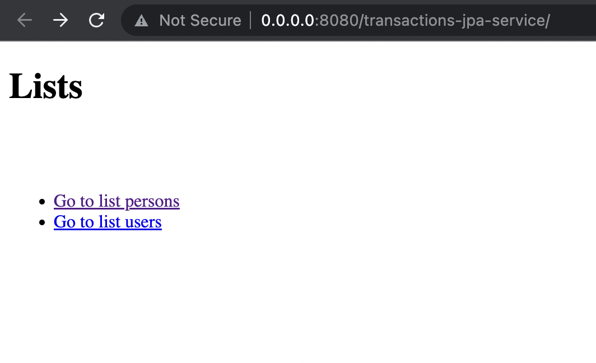

# jpa-jee-ejb-hibernate-jboss
Example for ejb with Java EE, hibernate and jpa in JBOSS

## Info
For this example I've used the follow resources:

* OS: Mac Monterrey
* JakartaEE: 8
* Maven: 3.8.4
* Hibernate: <provided>
* Server: Wildfly 25.0.0.0-Alpha
* PostgreSQL Driver: 14

## Deploy
Run `docker compose build`, then `docker compose up -d`, and finally `docker exec -t jpa-example-srv sh /opt/resources/install.sh`

After that, you can access to `http://0.0.0.0:8080/transactions-jpa-service`, and you will show a page similar to this:

## Test
Run the app `src/java/mx/com/hiringa/transactions/TransactionsClient.java` within the folder `transactions-jpa-client`

**Happy code! :)**
